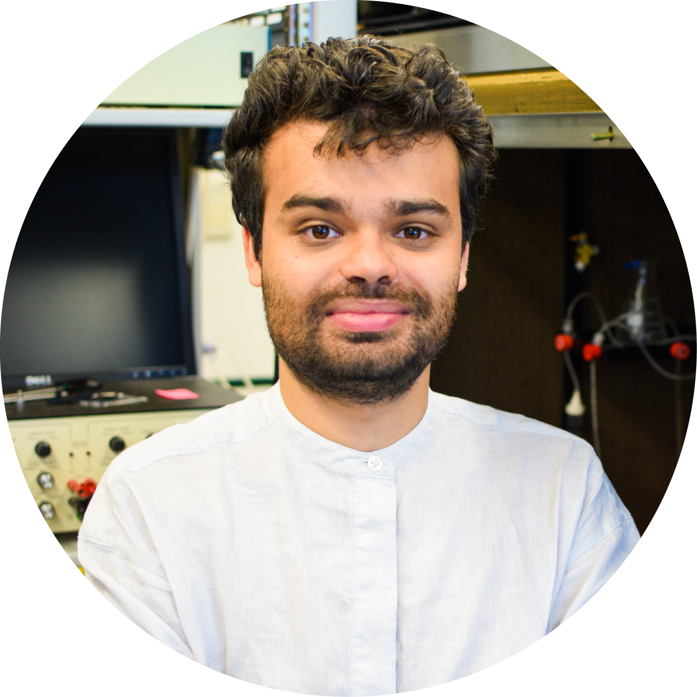

# [Dr. Alexander Shakeel Bates](https://as-bates.netlify.app/portfolio/) 

**Neuroscientist & Computational Biologist**

I am a neuroscientist and computational biologist specialising in
neuroanatomy, neurophysiology and connectomics of the insect brain. My
research focuses on understanding how neural circuits wire and fire to
generate complex behaviours, including olfactory processing and animal
navigation. I develop open-source tools for neuroanatomical analysis and
collaborate internationally on connectomics projects. In the wetlab, I
use virtual reality and calcium imaging experiments to interrogate
neurobiological circuits in living, behaving flies. I am a UK citizen.

------------------------------------------------------------------------

**Contact:** <alexander_bates@hms.harvard.edu> | [ORCID:
0000-0002-1195-0445](https://orcid.org/0000-0002-1195-0445) | [GitHub:
alexanderbates](https://github.com/alexanderbates)

**Metrics:** 4312 citations | h-index: 21 | i10-index: 24 | 16 peer
reviews

## Professional Research \_\_\_\_\_\_\_\_\_\_\_\_\_\_\_\_\_\_\_\_\_\_\_\_\_\_\_\_\_\_\_\_\_

**Postdoctoral Fellow in Neurobiology** • Harvard Medical School •
Boston, US • present - 01/10/2020

Investigating navigational circuitry using calcium imaging,
neurophysiology and behavioural studies involving virtual reality with
*Drosophila melanogaster*, in the laboratory of [Prof. Rachel
Wilson](https://neuro.hms.harvard.edu/faculty-staff/rachel-wilson) •
Co-leading an international collaboration with [Prof. Wei-Chung Allen
Lee](https://www.lee.hms.harvard.edu/),
[flywire](https://codex.flywire.ai/) and a network of international
research groups on the first whole fly central nervous system
connectome, open-access

## Fellowships & Grants \_\_\_\_\_\_\_\_\_\_\_\_\_\_\_\_\_\_\_\_\_\_\_\_\_\_\_\_\_\_\_\_\_\_\_

**Harvard Nomination for The Warren Alpert Distinguished Scholar Award**
• N/A • TBD • Current - 01/10/2022

Decision not yet made

**[Sir Henry Wellcome
Fellowship](https://wellcome.org/grant-funding/schemes/sir-henry-wellcome-postdoctoral-fellowships)**
• Wellcome Trust & University of Oxford • UK • 01/02/2026 - 01/06/2022

300,000 GBP towards my current research • Collaboration between groups
of Rachel Wilson, Wei Lee, Scott Waddell and Jan Drugowitsch • Also
accepted as Life Science Research Foundation fellow

**[EMBO
fellow](https://www.embo.org/funding/fellowships-grants-and-career-support/postdoctoral-fellowships/)**
• European Molecular Biology Organization • Europe • 01/06/2022 -
01/04/2021

Also accepted as a International Human Frontier Science Program fellow

**[Herchel Smith PhD
Scholarship](https://www.herchelsmith.cam.ac.uk/phd-studentships/current-phd-students)**
• Herchel Smith Foundation • Cambridge, UK • 30/09/2019 - 01/08/2015

**[Boehringer Ingelheim PhD
Scholarship](https://bifonds.de/fellowships-grants/phd-fellowships.html)**
• Boehringer Ingelheim Foundation • European • 01/08/2018 - 01/08/2016

## Education \_\_\_\_\_\_\_\_\_\_\_\_\_\_\_\_\_\_\_\_\_\_\_\_\_\_\_\_\_\_\_\_\_\_\_\_\_\_\_\_\_\_\_\_\_\_\_

**Neuroscience PhD** • [MRC LMB](https://www2.mrc-lmb.cam.ac.uk/),
University of Cambridge • Cambridge, UK • 30/02/2021 - 01/09/2015

PhD student with [Dr. Greg
Jefferis](https://en.wikipedia.org/wiki/Gregory_Jefferis) •
[**Thesis**](https://drive.google.com/file/d/1qiiAcquT948EcSC0SJYW85j8C-amOKkT/view):
The lateral horn, a brain region in the fly, primes innate olfactory
behaviours by combining patterns of second-order olfactory projection
neuron activity. In my work, I developed tools and analyses, and
reconstructed neural networks from electron microscopy data, in order to
better understand this brain region and how memory systems interact with
it • Neuroinformatics, data science, R programming • **Awards:**
[Honorary Vice Chancellor’s
Award](https://www.cambridgetrust.org/scholarships/v-c-awards-and-cambridge-international-scholarships/#:~:text=The%20aim%20of%20the%20Vice,research%20leading%20to%20a%20PhD.),
[MRC LMB Max Perutz Prize
2019](https://www2.mrc-lmb.cam.ac.uk/achievements/lmb-student-prize/),
Winner of the [British Neuroscience Association Postgraduate Prize
2020](https://www.bna.org.uk/members/student-prizes/)

**Neuroscience BSc** • University College London • London, UK •
01/07/2015 - 01/09/2012

1st class degree with honours • Modules taken listed on
[linkedIn](https://www.linkedin.com/in/alex-bates-22a265a7/) •
**Awards:** [Burnstock Sessional Prize in Neuroscience
BSc](https://www.ucl.ac.uk/biosciences/news/2020/jun/professor-geoffrey-burnstock-1929-2020)
(ranked first in year) (2012–2013) (2013-2014) (2014-2015), Dean’s list
for the Faculty of Life Sciences (2013-2014) (2014-2015), [Rob Clarke
Award](https://www.physoc.org/grants-and-prizes/prizes/the-rob-clarke-awards/)
from the Society of Physiology

**High School** • Woodbridge High School • London, UK • 01/09/2012 -
01/09/2008

6 A\*s at A-level, comprising: Physics, Chemistry, Mathematics, English
Literature, Philosophy and Russian, and in a history related EPQ (level
3) project • 13 A\*s at GCSE: English Literature, English Language,
Mathematics, Statistics, Core Science, Additional Science, History,
Philosophy, Geography, French, Italian, Russian and Expressive Arts.
[Jack Petchey Achievement
Award](https://www.jackpetcheyfoundation.org.uk/opportunities/grant-programmes/achievement-awards/)

## Presentations \_\_\_\_\_\_\_\_\_\_\_\_\_\_\_\_\_\_\_\_\_\_\_\_\_\_\_\_\_\_\_\_\_\_\_\_\_\_\_\_\_\_

**Selected Talks:** 4th Asia-Pacific Drosophila Neuroscience Conference
(APDNC4) (2026) • CSHL Neurobiology of Drosophila (2025) • FlyWire
Townhall (2025) • HMS Neurobiology Department Talk (2025) • CRANTb
Connectomics Symposium (2025) • CSHL Neuronal Circuits (2024) • ECRO
meeting (2019) • Boehringer Ingelheim Meeting (2018) • MPI Connectomics
meeting (2017) • ECRO meeting (2017) • Boehringer Ingelheim Meeting
(2017) • Brains and Roses (2016)

**Selected Posters:** HHMI Investigators’ Meeting (2023) • UK Neural
Computation (2019) • Boehringer Ingelheim Fonds communication workshop
(2017) • Maggot Meeting (2016) • High-resolution circuit reconstruction
meeting (2016) • LMB GSA Symposium (2016)

## Leadership Experience \_\_\_\_\_\_\_\_\_\_\_\_\_\_\_\_\_\_\_\_\_\_\_\_\_\_\_\_\_\_\_\_\_\_

COSYNE 2026 abstract reviewer (2026) • Teaching at the San Juan Winter
School for Connectomics (2025) • Attended HFP Leadership and Management
Skills Course for Postdocs (2023) • President of BlueSci (01/10/2019 -
01/01/2016) • Officially mentored summer student (2018) • Officially
mentored undergraduate student (01/05/2018 - 01/09/2017) • Officially
mentored summer student (2017) • LMB graduate symposium lead organiser
(2017) • LMB graduate symposium organiser (2016) • President of the UCLU
Writer’s Society (01/10/2015 - 01/10/2014) • Science Editor, Pi Magazine
(01/10/2015 - 01/10/2014) • UCL iGEM 2014 Advisor (2014)

## Other Experience \_\_\_\_\_\_\_\_\_\_\_\_\_\_\_\_\_\_\_\_\_\_\_\_\_\_\_\_\_\_\_\_\_\_\_\_\_\_\_

**Research Visits:** Janelia Research Campus (2019) | Worked in FlyEM,
[Dr. Gerry Rubin’s
Group](https://www.hhmi.org/scientists/gerald-m-rubin), Worked on the
hemibrain connectome • Janelia Research Campus (2016) | Worked with
[Dr. Albert Cardona’s
Group](https://www.janelia.org/people/albert-cardona), Worked on the L1
larval connectome • University of Queensland Winter Scholarship,
University of Queensland (2015) | Worked on tectal activity in zebrafish
larvae, light sheet imaging, [Dr. Ethan Scott’s
Group](https://researchers.uq.edu.au/researcher/1835) • [Amgen
Scholarship](https://amgenscholars.com/alumni-profile-alex-bates/),
Dept. Zoology, University of Cambridge (2014) | Worked on neuronal
structural plasticity in *Drosophila melanogaster* larvae,
[Dr. Landgraf’s
group](https://www.zoo.cam.ac.uk/directory/dr-matthias-landgraf)

**Training:** Paris Spring School in Neuroscience Techniques, Paris
Descartes University (2018) | [A course
in](https://www.google.com/url?q=https://parisneuro.ovh/&sa=D&source=editors&ust=1626576404921000&usg=AOvVaw3eOj4rTk3Uv6H6IJSM3JZb)
Optical Imaging and Electrophysiological Recording in Neuroscience • UCL
iGEM 2013 team member, University College London (2013) | Team member,
cloning, cell culture, project planning, Gold medallist • Summer student
in the biomolecular modelling laboratory, Cancer Research UK, London
Research Institute (2013) | Student Placement with [Dr. Tammy
Cheng](https://bmm.crick.ac.uk/~cheng03/Biography.html), python
programming

**Technical Skills:** R • python • MATLAB • github • git • markdown •
Illustrator • InDesign • communication • text editing • journalistic
writing • creative writing • open access

## Data and Code \_\_\_\_\_\_\_\_\_\_\_\_\_\_\_\_\_\_\_\_\_\_\_\_\_\_\_\_\_\_\_\_\_\_\_\_\_\_\_\_\_\_\_

**Public Datasets:**  
- [BANC Adult Fly Brain
Connectome](https://dataverse.harvard.edu/dataset.xhtml?persistentId=doi:10.7910/DVN/8TFGGB)
(DOI: 10.7910/DVN/8TFGGB) - Complete synaptic-resolution connectome of
an adult female Drosophila melanogaster brain and ventral nerve cord

**Open Source Software Contributions:**  
*natverse* (20 repositories): [nat](https://github.com/natverse/nat) •
[nat.nblast](https://github.com/natverse/nat.nblast) •
[fafbseg](https://github.com/natverse/fafbseg) •
[natverse](https://github.com/natverse/natverse) •
[nat.examples](https://github.com/natverse/nat.examples) •
[rcatmaid](https://github.com/natverse/rcatmaid) •
[mouselightr](https://github.com/natverse/mouselightr) •
[elmr](https://github.com/natverse/elmr) •
[hemibrainr](https://github.com/natverse/hemibrainr) •
[flycircuit](https://github.com/natverse/flycircuit) •
[neuprintr](https://github.com/natverse/neuprintr) •
[nat.ggplot](https://github.com/natverse/nat.ggplot) •
[fishatlas](https://github.com/natverse/fishatlas) •
[nat.h5reg](https://github.com/natverse/nat.h5reg) •
[neuromorphr](https://github.com/natverse/neuromorphr) •
[neuronbridger](https://github.com/natverse/neuronbridger) •
[influencer](https://github.com/natverse/influencer) •
[drvid](https://github.com/natverse/drvid) •
[natverse\_hugo](https://github.com/natverse/natverse_hugo) •
[insectbrainr](https://github.com/natverse/insectbrainr)  
*wilson-lab* (3 repositories):
[design-files](https://github.com/wilson-lab/design-files) •
[nat-tech](https://github.com/wilson-lab/nat-tech) •
[panels-matlab](https://github.com/wilson-lab/panels-matlab)  
*htem* (1 repositories):
[BANC-project](https://github.com/htem/BANC-project)  
*flyconnectome* (4 repositories):
[2020hemibrain\_examples](https://github.com/flyconnectome/2020hemibrain_examples)
• [bancr](https://github.com/flyconnectome/bancr) •
[hemibrain\_olf\_data](https://github.com/flyconnectome/hemibrain_olf_data)
• [crantr](https://github.com/flyconnectome/crantr)

**Zenodo Datasets:**  
- [Connectome Influence Calculator](https://zenodo.org/records/17693838)
(DOI: 10.5281/zenodo.17693838) - Downloads: 16  
- [Supplementary data to accompany Information flow, cell types and
stereotypy in a full olfactory
connectome](https://zenodo.org/records/4383228) (DOI:
10.5281/zenodo.4383228) - Downloads: 551  
- [Supplemental Files for Eckstein and Bates et al., Cell
(2024)](https://zenodo.org/records/10593546) (DOI:
10.5281/zenodo.10593546) - Downloads: 954  
- [BAcTrace a new tool for retrograde tracing of neuronal
circuits](https://zenodo.org/records/3797211) (DOI:
10.5281/zenodo.3797211) - Downloads: 1,491

## Publications \_\_\_\_\_\_\_\_\_\_\_\_\_\_\_\_\_\_\_\_\_\_\_\_\_\_\_\_\_\_\_\_\_\_

**Distributed control circuits across a brain-and-cord connectome**
(2025). <ins>***AS Bates***</ins>†‡, JS Phelps†‡, M Kim†, HH Yang†, A
Matsliah, Z Ajabi, E Perlman, … *bioRxiv,* in review at Nature\*\*
\[citations: 11\]  
**Neurotransmitter classification from electron microscopy images at
synaptic sites in Drosophila melanogaster** (2024). N Eckstein†,
<ins>***AS Bates***</ins>†, A Champion, M Du, Y Yin, P Schlegel, AKY Lu,
… *Cell* \[citations: 205\]  
**Information flow, cell types and stereotypy in a full olfactory
connectome** (2021). P Schlegel†, <ins>***AS Bates***</ins>†, T Stürner,
SR Jagannathan, N Drummond, J Hsu, … *Elife* \[citations: 157\]  
**Complete connectomic reconstruction of olfactory projection neurons in
the fly brain** (2020). <ins>***AS Bates***</ins>†, P Schlegel†, RJV
Roberts, N Drummond, IFM Tamimi, … *Curr. Biology* \[citations: 207\]  
**The natverse, a versatile toolbox for combining and analysing
neuroanatomical data** (2020). <ins>***AS Bates***</ins>†, JD Manton†,
SR Jagannathan, M Costa, P Schlegel, T Rohlfing, … *Elife* \[citations:
206\]  
**Analysis and optimization of equitable US cancer clinical trial center
access by travel time** (2024). H Lee†, **AS Bates**, S Callier, M Chan,
N Chambwe, A Marshall, MB Terry, … *JAMA oncology* \[citations: 14\]  
**Functional and anatomical specificity in a higher olfactory centre**
(2019). S Frechter†, **AS Bates**, S Tootoonian, MJ Dolan, J Manton, AR
Jamasb, … *eLife* \[citations: 115\]  
**Neural circuit mechanisms for steering control in walking Drosophila**
(2025). A Rayshubskiy†, SL Holtz, **AS Bates**, QX Vanderbeck, LS
Capdevila, … *ELife* \[citations: 101\]  
**Quantitative Attributions with Counterfactuals** (2024). DY Adjavon†,
N Eckstein, **AS Bates**, GSXE Jefferis, J Funke *bioRxiv*  
**Whole-brain annotation and multi-connectome cell typing of
Drosophila** (2024). P Schlegel†, Y Yin, **AS Bates**, S Dorkenwald, K
Eichler, P Brooks, DS Han, … *Nature* \[citations: 333\]  
**Discriminative attribution from paired images** (2022). N Eckstein†, H
Bukhari, **AS Bates**, GSXE Jefferis, J Funke *Euro. Conf. on Computer
Vision* \[citations: 8\]  
**BAcTrace, a tool for retrograde tracing of neuronal circuits in
Drosophila** (2020). S Cachero†, M Gkantia, **AS Bates**, S Frechter, L
Blackie, A McCarthy, … *Nature methods* \[citations: 45\]  
**Neurogenetic dissection of the Drosophila lateral horn reveals major
outputs, diverse behavioural functions, and interactions with the
mushroom body** (2019). MJ Dolan†, S Frechter, **AS Bates**, C Dan, P
Huoviala, RJ Roberts, … *Elife* \[citations: 167\]  
**Communication from learned to innate olfactory processing centers is
required for memory retrieval in Drosophila** (2018). MJ Dolan†, G
Belliart-Guérin, **AS Bates**, S Frechter, A Lampin-Saint-Amaux, …
*Neuron* \[citations: 117\]  
**Automated reconstruction of a serial-section EM Drosophila brain with
flood-filling networks and local realignment** (2019). PH Li†, LF
Lindsey, M Januszewski, Z Zheng, **AS Bates**, I Taisz, M Tyka, …
*bioRxiv* \[citations: 105\]  
**Sexual dimorphism in the complete connectome of the Drosophila male
central nervous system** (2025). S Berg†, IR Beckett, M Costa, P
Schlegel, M Januszewski, EC Marin, … *bioRxiv* \[citations: 4\]  
**Comparative connectomics of Drosophila descending and ascending
neurons** (2025). T Stürner†, P Brooks, L Serratosa Capdevila, BJ
Morris, A Javier, S Fang, … *Nature* \[citations: 35\]  
**A Drosophila computational brain model reveals sensorimotor
processing** (2024). PK Shiu†, GR Sterne, N Spiller, R Franconville, A
Sandoval, J Zhou, … *Nature* \[citations: 76\]  
**Network statistics of the whole-brain connectome of Drosophila**
(2024). A Lin†, R Yang, S Dorkenwald, A Matsliah, AR Sterling, P
Schlegel, S Yu, … *Nature* \[citations: 110\]  
**Neuronal wiring diagram of an adult brain** (2024). S Dorkenwald†, A
Matsliah, AR Sterling, P Schlegel, SC Yu, CE McKellar, … *Nature*
\[citations: 479\]  
**The connectome of the adult Drosophila mushroom body provides insights
into function** (2020). F Li†, JW Lindsey, EC Marin, N Otto, M Dreher, G
Dempsey, I Stark, … *Elife* \[citations: 381\]  
**A connectome and analysis of the adult Drosophila central brain**
(2020). LK Scheffer†, CS Xu, M Januszewski, Z Lu, S Takemura, KJ
Hayworth, … *eLife* \[citations: 1113\]  
**Connectomics analysis reveals first-, second-, and third-order
thermosensory and hygrosensory neurons in the adult Drosophila brain**
(2020). EC Marin†, L Büld, M Theiss, T Sarkissian, RJV Roberts, R
Turnbull, … *Curr. Biology* \[citations: 105\]  
**Input connectivity reveals additional heterogeneity of dopaminergic
reinforcement in Drosophila** (2020). N Otto†, MW Pleijzier, IC Morgan,
AJ Edmondson-Stait, KJ Heinz, I Stark, … *Curr. Biology* \[citations:
80\]  
**Neural circuit basis of aversive odour processing in Drosophila from
sensory input to descending output** (2018). P Huoviala†, MJ Dolan, FM
Love, P Myers, S Frechter, S Namiki, … *bioRxiv* \[citations: 48\]  
**Combinatorial encoding of odors in the mosquito antennal lobe**
(2023). P Singh†, S Goyal, S Gupta, S Garg, A Tiwari, V Rajput, **AS
Bates**, … *Nature Comm.* \[citations: 17\]

† denotes first author  
‡ denotes corresponding author

## Review Articles \_\_\_\_\_\_\_\_\_\_\_\_\_\_\_\_\_\_\_\_\_\_\_\_\_\_\_\_\_\_\_\_\_\_\_\_\_\_\_\_\_

**Systems neuroscience: Auditory processing at synaptic resolution**
(2022). <ins>***AS Bates***</ins>, G Jefferis *Curr. Biology*
\[citations: 1\]  
**Neuronal cell types in the fly: single-cell anatomy meets single-cell
genomics** (2019). <ins>***AS Bates***</ins>, J Janssens, GS Jefferis, S
Aerts *Curr. opinion in neurobiology* \[citations: 72\]  

## Referees \_\_\_\_\_\_\_\_\_\_\_\_\_\_\_\_\_\_\_\_\_\_\_\_\_\_\_\_\_\_\_\_\_\_\_\_\_\_\_\_\_\_\_\_\_\_\_

**Postdoc Supervisor:** Prof. Rachel Wilson, Harvard Medical School,
<Rachel_Wilson@hms.harvard.edu> **PhD Supervisor:** Dr. Gregory
Jefferis, MRC Laboratory of Molecular Biology, Cambridge,
<jefferis@mrc-lmb.cam.ac.uk> **Key Collaborator:** Prof. Wei-Chung Allen
Lee, Harvard Medical School, <Wei-Chung_Lee@hms.harvard.edu> **BSc
Tutor:** Dr. Marco Beato, UCL Neuroscience, <m.beato@ucl.ac.uk>
**Supervisee:** Serene Dhawan, Princeton PhD student,
<serenedhawan@gmail.com>

------------------------------------------------------------------------

*Updated: 04 December 2025*
