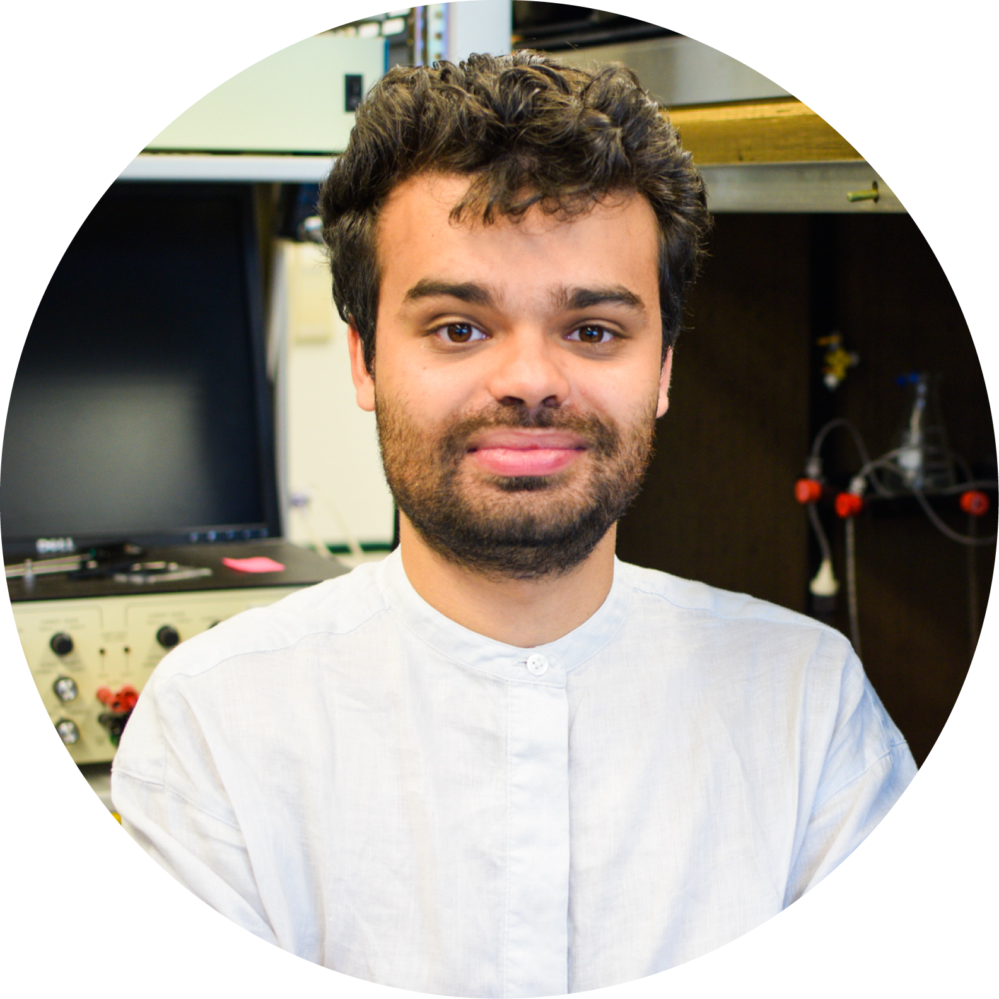
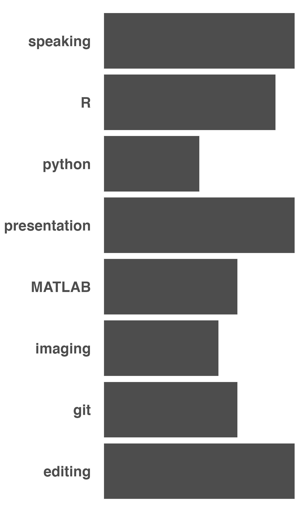

```{r startup, echo = FALSE, message = FALSE, warning = FALSE}
knitr::opts_chunk$set(
  results='asis',
  echo = FALSE,
  warning = FALSE,
  message = FALSE
)
library(pagedown)
library(tidyverse)
library(glue)
library(icons)
library(scholar)
library(formattable)
library(ggplot2)
library(magrittr) # For the pipe
library(plotly)
library(extrafont)
library(extrafontdb)
library(rorcid)
asb.id <- '0000-0002-1195-0445'#orcid_auth()
id <- "BOVTiXIAAAAJ&hl"
source("cv_printing_functions.r")
```

```{r pub_data}
publications <- scholar::get_publications(id, sortby = "year", pagesize = 100, flush = TRUE)
publications <- subset(publications, ! journal %in% c("CHEMICAL SENSES","University of Cambridge",""))
authorlist <- publications$author
publications$journal[publications$journal %in% c("BioRxiv","Biorxiv","biorxiv")] <- "bioRxiv"
publications$position <- author_position(authorlist, scholar::get_profile(id)$name)$Position
publications$position[is.na(publications$position)] = 6
publications$IF <- scholar::get_impactfactor(publications$journal, max.distance = 0.05)$ImpactFactor
publications$IF[is.na(publications$IF)] = 0
publications$IF <- round(publications$IF)
publications$author = gsub("AS Bates","**AS Bates**",publications$author)
publications$title = paste0("<a href='","https://scholar.google.com/scholar?oi=bibs&hl=en&cites=",gsub(",.*","",publications$cid), "'>",publications$title,"</a>")

# Bold for first author
first.pubids <- c("mVmsd5A6BfQC", "8k81kl-MbHgC", 
                  "Y0pCki6q_DkC", "eQOLeE2rZwMC", 
                  "d1gkVwhDpl0C", "hqOjcs7Dif8C",
                  "_FxGoFyzp5QC")
first <- publications$pubid%in%first.pubids
publications$position[first] <- 1
publications$author[first] <- gsub("AS Bates", "<ins>AS Bates</ins>",publications$author[first])
publications <- publications[,c("title","author","journal","year","cites", "position","IF")]
publications <- dplyr::arrange(publications, position, dplyr::desc(year))

# Get DOIs


# Separate out reviews
revs <- c("Systems neuroscience: Auditory processing at synaptic resolution",
          "Neuronal cell types in the fly: single-cell anatomy meets single-cell genomics")
revs <- paste0(revs,collapse="|")
reviews <- subset(publications, grepl(revs,title))
publications <- subset(publications, ! grepl(revs,title))

# Corrections
corr <- c("Neurotransmitter Classification from Electron Microscopy Images at Synaptic Sites in Drosophila Melanogaster")
publications$journal[publications$title%in%corr] <- "*Accepted at Cell*"
publications$year[publications$title%in%corr] <- "2023"

# Get peer reviews
prs <- rorcid::orcid_peer_reviews(asb.id)
plucked_prs <- prs %>%
  purrr::map_dfr(pluck, "group") %>%
  janitor::clean_names() %>%
  dplyr::mutate(last_modified_date_value = anytime::anydate(last_modified_date_value/1000))
peer_reviews <- data.frame()
for(i in 1:length(plucked_prs$peer_review_group)){
  pr.df <- do.call(plyr::rbind.fill,plucked_prs$peer_review_group[[i]]$`peer-review-summary`) %>%
      janitor::clean_names() %>%
      as.data.frame()
  issn <- gsub("issn\\:","",pr.df$review_group_id)
  details <- rcrossref::cr_journals(issn = issn, works = FALSE)
  journals <- data.frame(journal = details$data$title)
  peer_reviews <- plyr::rbind.fill(peer_reviews,journals)
}
peer_reviews <- peer_reviews %>%
  dplyr::group_by(journal) %>%
  dplyr::mutate(reviews = dplyr::n()) %>%
  dplyr::ungroup() %>%
  dplyr::arrange(dplyr::desc(reviews)) %>%
  dplyr::distinct(journal, reviews)
#read_csv(file = "peer_reviews.csv", show_col_types = FALSE)
```

<!-- inicio academic icons -->
<link rel="stylesheet" href="https://cdn.jsdelivr.net/gh/jpswalsh/academicons@1/css/academicons.min.css">
<!-- final academic icons -->

 
<!-- inicio font awesome -->
<script src="https://kit.fontawesome.com/1f72d6921a.js" crossorigin="anonymous"></script>
<!-- final font awesome -->

```{r, include=FALSE}
# Read in all data and initialize a CV printer object
CV <- create_CV_object(
  data_location = "",  
  pdf_mode = params$pdf_mode
)
CV$entries_data <- CV$entries_data %>% dplyr::filter(in_resume == TRUE)
```


```{r}
# When in pdf export mode the little dots are unaligned, so fix that with some conditional CSS.
if(params$pdf_mode) {
    cat("
<style>
:root{
  --decorator-outer-offset-left: -6.5px;
}
</style>")
}
```

Aside
================================================================================

```{r logo}
cat("")
# Add plotly brain??
```

```{r pdf_mode}
if(params$pdf_mode){
  cat("View this resume online with links at asbates.com/CV")
} else {
  cat("<i class='fas fa-download'></i> [download this resume](https://github.com/alexanderbates/asbates/raw/main/resume/index.pdf)")
}
```

<br></br>

**Media**

```{r contact_info}
CV$contact_info %>% glue_data("- <i class='{icon}'></i> {contact}")
```
<br></br>

<br></br>

**Software**

<i class="fas fa-toolbox"></i> [natverse](https://natverse.org/) - co-author

<i class="fas fa-tools"></i> [neuromorphr](https://natverse.github.io/neuromorphr/) - author

<i class="fas fa-tools"></i> [neuronbridger](https://natverse.github.io/neuronbridger/) - author

<i class="fas fa-tools"></i> [neuprintr](https://natverse.github.io/neuprintr/) - author

<i class="fas fa-tools"></i> [hemibrainr](https://natverse.github.io/hemibrainr/) - author

<i class="fas fa-tools"></i> [mouselightr](https://natverse.github.io/mouselightr/) - author

<i class="fas fa-tools"></i> [insectbrainr](https://natverse.github.io/insectbrainr/) - author

Main
================================================================================

Dr. Alexander Shakeel Bates {#title}
--------------------------------------------------------------------------------

```{r intro}
print_text_block(CV, 'intro')
```

```{r profile, fig.align = "center"}
author <- scholar::get_profile(id)
df <- data.frame(total_cites = author$total_cites, h_index = author$h_index, i10_index = author$i10_index)
formattable(df, list(total_cites = color_bar("coral", fun = "normalize"), h_index = color_bar("lightgreen", fun = "proportion"), i10_index = color_bar("lightblue", fun = "proportion")))
```

Professional Research {data-icon=microscope data-concise=true}
--------------------------------------------------------------------------------

```{r research}
CV %<>% print_section('research_projects')
```

Grants {data-icon=connectdevelop data-concise=true}
--------------------------------------------------------------------------------

```{r grants}
CV %<>% print_section('grants')
```

::: aside

**Skills**

```{r skill_bar}
# print_skill_bars(CV)
# p <-ggplot(data=CV$skills, aes(x=skill, y=level)) +
#   geom_bar(stat="identity", fill="#4D4D4D")+
#   coord_flip() + 
#   theme(
#     axis.title.y = element_blank(),
#     axis.title.x = element_blank(),
#     axis.text.y = element_text(size=20, face="bold", colour = "#4D4D4D", family = "sans"),
#     axis.text.x=element_blank(),
#     axis.ticks.y=element_blank(),
#     axis.ticks.x=element_blank(),
#     panel.background = element_rect(fill = "transparent"), # bg of the panel
#     plot.background = element_rect(fill = "transparent", color = NA), # bg of the plot
#     panel.grid.major = element_blank(), # get rid of major grid
#     panel.grid.minor = element_blank(), # get rid of minor grid
#     legend.background = element_rect(fill = "transparent"), # get rid of legend bg
#     legend.box.background = element_rect(fill = "transparent") # get rid of legend panel bg
#   )
# ggsave(p, filename = "skills.png",  bg = "transparent", units = "cm", height = 25, width = 15)
# cat("")
CV$skills %>% glue_data("- <i class='{icon}'></i> {skill}")
```

<br></br>

<br></br>

**Peer Reviews**

```{r peer_reviews}
# Format reviews table
formattable(peer_reviews, list(
  reviews = color_bar("lightgreen", fun = "normalize")
  ))
```

<br></br>

<br></br>

**Referees** 

- <i class="fas fa-robot"></i> PhD Supervisor: Dr. Gregory Jefferis, MRC Laboratory of Molecular Biology, Cambridge, jefferis@mrc-lmb.cam.ac.uk

- <i class="fas fa-user-secret"></i> Current Supervisor: Prof. Rachel Wilson, Harvard Medical School, [Rachel_Wilson@ hms.harvard.edu](Rachel_Wilson@hms.harvard.edu)

- <i class="fas fa-user-graduate"></i> BSc Tutor at UCL: Dr. Marco Beato, UCL Neuroscience, Physiology and Pharmacology, m.beato@ucl.ac.uk

- <i class="fas fa-user-astronaut"></i> Supervisee: 
Serene Dhawan, 
Princeton, PhD student, 
[serenedhawan @gmail.com](serenedhawan@gmail.com])

:::

Education {data-icon=graduation-cap data-concise=true}
--------------------------------------------------------------------------------

```{r education}
CV %<>% print_section('education')
```

Reviews {data-icon=eye}
--------------------------------------------------------------------------------

```{r reviews}
# Format reviews table
formattable(reviews, list(
  position = FALSE, # color_bar("lightgreen", fun = "normalize"),
  cites = color_bar("coral", fun = "normalize"),
  IF = FALSE, # color_bar("lightblue", fun = "normalize"),
  number = FALSE,
  cid = FALSE,
  pubid = FALSE))
```

Papers {data-icon=book}
--------------------------------------------------------------------------------

::: aside

```{r pubs}
print_text_block(CV, 'publications')
```

<i class="ai ai-biorxiv"></i> Most of my work has first been published on bioRxiv

<i class="ai ai-open-access"></i> Much of my work comes with open source R code

:::

```{r publications}
#CV %<>% print_section('publications')
# Format publication table
formattable(publications, list(
  position = FALSE, # color_bar("lightgreen", fun = "normalize"),
  cites = color_bar("coral", fun = function(x) x/100),
  IF = FALSE, # color_bar("lightblue", fun = "normalize"),
  number = FALSE,
  cid = FALSE,
  pubid = FALSE))
```

Selected Talks {data-icon=chalkboard-teacher}
--------------------------------------------------------------------------------

```{r meetings}
CV %<>% print_section('meetings')
```

Selected Posters {data-icon=chart-area}
--------------------------------------------------------------------------------

```{r posters}
CV %<>% print_section('posters')
```

Leadership {data-icon=flag}
--------------------------------------------------------------------------------

```{r leadership}
CV %<>% print_section('leadership_experience')
```

Other {data-icon=share-alt}
--------------------------------------------------------------------------------

```{r other}
CV %<>% print_section('experience')
```

::: aside

Disclaimer {#disclaimer}
--------------------------------------------------------------------------------

Made with the R package [**pagedown**](https://github.com/rstudio/pagedown) and [**datadrivencv**](http://nickstrayer.me/datadrivencv/index.html).

Code available on <i class="fa fa-github"></i> [GitHub](https://github.com/alexanderbates/asbates). 

Last updated on `r Sys.Date()`. 

:::

```{r links}
if(params$pdf_mode) {
  CV %<>% print_links()
}
```

